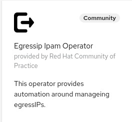

# EgressIP IPAM Operator


[](https://goreportcard.com/report/github.com/redhat-cop/egressip-ipam-operator)

[](https://doc.crds.dev/github.com/redhat-cop/egressip-ipam-operator)

This operator automates the assignment of egressIPs to namespaces.

- [EgressIP IPAM Operator](#egressip-ipam-operator)
  - [Passing EgressIPs as input](#passing-egressips-as-input)
  - [Assumptions](#assumptions)
  - [Considerations on High-Availability](#considerations-on-high-availability)
  - [Support for AWS](#support-for-aws)
  - [Support for Azure](#support-for-azure)
  - [Support for vSphere](#support-for-vsphere)
  - [Support for oVirt / Red Hat Virtualization](#support-for-ovirt--red-hat-virtualization)
  - [Deploying the Operator](#deploying-the-operator)
    - [Multiarch Support](#multiarch-support)
    - [Deploying from OperatorHub](#deploying-from-operatorhub)
      - [Deploying from OperatorHub UI](#deploying-from-operatorhub-ui)
      - [Deploying from OperatorHub using CLI](#deploying-from-operatorhub-using-cli)
    - [Deploying with Helm](#deploying-with-helm)
  - [Metrics](#metrics)
    - [Testing metrics](#testing-metrics)
  - [Development](#development)
  - [Running the operator locally](#running-the-operator-locally)
    - [Test helm chart locally](#test-helm-chart-locally)
  - [Building/Pushing the operator image](#buildingpushing-the-operator-image)
  - [Deploy to OLM via bundle](#deploy-to-olm-via-bundle)
  - [Testing](#testing)
    - [Baremetal test](#baremetal-test)
    - [AWS test](#aws-test)
    - [Azure test](#azure-test)
  - [Releasing](#releasing)
    - [Cleaning up](#cleaning-up)

Namespaces can opt in to receiving one or more egressIPs with the following annotation `egressip-ipam-operator.redhat-cop.io/egressipam:<egressIPAM>`, where `egressIPAM` is the CRD that controls how egressIPs are assigned.
IPs assigned to the namespace can be looked up in the following annotation: `egressip-ipam-operator.redhat-cop.io/egressips`.

EgressIP assignments is managed by the EgressIPAM CRD. Here is an example of it:

```yaml
apiVersion: redhatcop.redhat.io/v1alpha1
kind: EgressIPAM
metadata:
  name: example-egressipam
spec:
  cidrAssignments:
    - labelValue: "true"
      CIDR: 192.169.0.0/24
      reservedIPs:
      - "192.159.0.5"
  topologyLabel: egressGateway
  nodeSelector:
    matchLabels:
      node-role.kubernetes.io/worker: ""
```

This EgressIPAM specifies that all nodes that comply with the specified node selector and that also have labels `egressGateway: "true"` will be assigned egressIP from the specified CIDR.

Note that the `cidrAssigments` field is an array and therefore, multiple groups of nodes can be identified with the labelValue and different CIDRs can be assigned to them. This is usually not necessary on a bare metal deployment.

In the bare metal scenario, when this egressCRD is created, all the `hostsubnet` relative to the nodes selected by this EgressIPAM will be update to have the EgressCIDRs field equal to the specified CIDR (see below for cloud provider scenarios).

When a namespace is created with the opt-in annotation: `egressip-ipam-operator.redhat-cop.io/egressipam=<egressIPAM>`, an available egressIP is selected from the CIDR and assigned to the namespace.The `netnamespace` associated with this namespace is updated to use that egressIP.

It is possible to specify a set of reserved IPs. These IPs must belong to the CIDR and will never be assigned.

## Passing EgressIPs as input

The normal mode of operation of this operator is to pick a random IP from the configured CIDR. However, it also supports a scenario where egressIPs are picked by an external process and passed as input.

In this case IPs must me passed as an annotation to the namespace, like this: `egressip-ipam-operator.redhat-cop.io/egressips=IP1,IP2...`. The value of the annotation is a comma separated array of ip with no spaces.

There must be exactly one IP per CIDR defined in the referenced egressIPAM. Moreover, each IP must belong to the corresponding CIDR. Because this situation can lead to inconsistencies, failing to have correspondence between IPs in the namespace annotation and CIDRs in the egressIPAM CR will cause the operator to error out and stop processing all the namespaces associated with the given EgressIPAM CR.

It also also a responsibility of the progress picking the IPs to ensure that those IPs are actually available.

## Assumptions

The following assumptions apply when using this operator:

1. If multiple EgressIPAMs are defined, their selected nodes MUST NOT overlap. The behavior of the operator is undefined if this constraint is not met.

## Considerations on High-Availability

This operator has the ability to detect failed nodes and move the egressIPs these nodes were carring to other nodes. However this mechanism is relatively slow (order of magnitudes is minutes), so it should be considered a self-healing mechanism.

Shuffling EgressIPs around is an involved process because cloud providers are hardly designed for this use case especially when VM instances are carrying several EgressIPs. So we encourage users to test this process in their specific deployment as it will be certainly triggered when doing an OpenShift upgrade.

If you are looking for High Availability, i.e. the ability to continue to operate when the node carrying the EgressIP goes down, you have to define multiple CIDRs in the CR. This way each namespace will get multiple EgressIPs enabling OpenShift to use the secondary EgressIP when the first EgressIP is not available. Multiple egress EgressIPs per namespace are only supported when the EgressIPs are manually assigned to the node’s HostSubnet. However, the operator will take care of it and assign each EgressIP explicitly to the node instead of assigning the CIDR.

## Support for AWS

In AWS as well as other cloud providers, one cannot freely assign IPs to machines. Additional steps need to be performed in this case. Considering this EgressIPAM

```yaml
apiVersion: redhatcop.redhat.io/v1alpha1
kind: EgressIPAM
metadata:
  name: egressipam-aws
spec:
  cidrAssignments:
    - labelValue: "eu-central-1a"
      CIDR: 10.0.128.0/20
    - labelValue: "eu-central-1b"
      CIDR: 10.0.144.0/20
    - labelValue: "eu-central-1c"
      CIDR: 10.0.160.0/20
  topologyLabel: failure-domain.beta.kubernetes.io/zone
  nodeSelector:
    matchLabels:
      node-role.kubernetes.io/worker: ""
```

When a namespace with the opt-in annotation is created, the following happens:

1. for each of the CIDRs, an available IP is selected and assigned to the namespace.
2. the relative `netnamespace` is update to reflect the assignment (multiple IPs will be assigned in this case).
3. one node per zone is selected to carry the egressIP.
4. the relative aws machines are assigned the additional IP on the main interface (support for secondary interfaces in not available).
5. the relative `hostsubnets` are updated to reflect the assigned IP, the `egressIP` field is updated.

When running on AWS it is highly recommend the topology label be `topology.kubernetes.io/zone` or the deprecated `failure-domain.beta.kubernetes.io/zone`.

## Support for Azure

In Azure as well as other cloud providers, one cannot freely assign IPs to machines. Additional steps need to be performed in this case. Considering this EgressIPAM

```yaml
apiVersion: redhatcop.redhat.io/v1alpha1
kind: EgressIPAM
metadata:
  name: egressipam-azure
spec:
  # Add fields here
  cidrAssignments:
    - labelValue: ""
      CIDR: 10.0.32.0/19
      reservedIPs: 
      - "10.0.32.8"
  topologyLabel: "node-role.kubernetes.io/worker"
  nodeSelector:
    matchLabels:
      node-role.kubernetes.io/worker: ""
```

Differently from AWS, in Azure networks can span multiple AZs and that is the way OCP is installed by default.

When a namespace with the opt-in annotation is created, the following happens:

1. for the default vnet CIDR, an available IP is selected and assigned to the namespace.
2. the relative `netnamespace` is update to reflect the assignment (multiple IPs will be assigned in this case).
3. one node in the default vnet is selected to carry the egressIP.
4. the relative Azure machine is assigned the additional IP on the primary NIC (support for secondary interfaces in not available).
5. the relative `hostsubnet` is updated to reflect the assigned IP, the `egressIP` field is updated.

By default, the Egress IP address is added to the members of the backend pool of the load balancer. The determination of whether to attach this assignment is configured through the `egressip-ipam-operator.redhat-cop.io/azure-egress-load-balancer` annotation. Valid values are `same-as-primary-ip` (Default as well as undefined) which will associate the IP address to the same load balancer as the primary IP on the same NIC or `none` which will not associate any address. When operating in Azure Red Hat OpenShift, it is recommended that `none` by specified. 

## Support for vSphere

Egress-ipam-operator treats vSphere as a bare metal installation, so it will work with a network setup in which secondary IPs can be added to the VMs with no interaction with the vSphere API.
You can use the egressip-ipam-operator on your vSphere installation assuming that the nodes you want to use are labelled according to the `topologyLabel`. You can label them manually, or by changing the MachineSet configuration:

```yaml
apiVersion: machine.openshift.io/v1beta1
kind: MachineSet
metadata:
  {...}
spec:
  template:
    metadata:
      {...}
    spec:
      metadata:
        labels:
          egressGateway: 'true'
```

This example MachineSet object lets the [machine-api-operator](https://github.com/openshift/machine-api-operator) label all newly created nodes with the label `egressGateway: 'true'` which can then be selected by the egressip-ipam-operator with this example EgressIPAM configuration:

```yaml
apiVersion: redhatcop.redhat.io/v1alpha1
kind: EgressIPAM
metadata:
  name: egressipam-vsphere
spec:
  cidrAssignments:
    - labelValue: "true"
      CIDR: 192.169.0.0/24
      reservedIPs:
      - "192.159.0.5"
  topologyLabel: egressGateway
  nodeSelector:
    matchLabels:
      node-role.kubernetes.io/worker: ""
```

## Support for oVirt / Red Hat Virtualization

Egress-ipam-operator treats RHV as a bare metal installation, so it will work with a network setup in which secondary IPs can be added to the VMs with no intereaction with the RHV API. Refer to the vSphere section for more details.
Example EgressIPAM configuration:

```yaml
apiVersion: redhatcop.redhat.io/v1alpha1
kind: EgressIPAM
metadata:
  name: egressipam-rhv
spec:
  cidrAssignments:
    - labelValue: "true"
      CIDR: 192.169.0.0/24
      reservedIPs:
      - "192.159.0.5"
  topologyLabel: egressGateway
  nodeSelector:
    matchLabels:
      node-role.kubernetes.io/worker: ""
```

## Deploying the Operator

This is a cluster-level operator that you can deploy in any namespace, `egressip-ipam-operator` is recommended.

It is recommended to deploy this operator via [`OperatorHub`](https://operatorhub.io/), but you can also deploy it using [`Helm`](https://helm.sh/).

### Multiarch Support

| Arch  | Support  |
|:-:|:-:|
| amd64  | ✅ |
| arm64  | ✅  |
| ppc64le  | ✅  |
| s390x  | ✅  |

### Deploying from OperatorHub

> **Note**: This operator supports being installed disconnected environments

If you want to utilize the Operator Lifecycle Manager (OLM) to install this operator, you can do so in two ways: from the UI or the CLI.

#### Deploying from OperatorHub UI

* If you would like to launch this operator from the UI, you'll need to navigate to the OperatorHub tab in the console. Before starting, make sure you've created the namespace that you want to install this operator to with the following:

```shell
oc new-project egressip-ipam-operator
```

* Once there, you can search for this operator by name: `egressip ipam operator`. This will then return an item for our operator and you can select it to get started. Once you've arrived here, you'll be presented with an option to install, which will begin the process.
* After clicking the install button, you can then select the namespace that you would like to install this to as well as the installation strategy you would like to proceed with (`Automatic` or `Manual`).
* Once you've made your selection, you can select `Subscribe` and the installation will begin. After a few moments you can go ahead and check your namespace and you should see the operator running.



#### Deploying from OperatorHub using CLI

If you'd like to launch this operator from the command line, you can use the manifests contained in this repository by running the following:

oc new-project egressip-ipam-operator

```shell
oc apply -f config/operatorhub -n egressip-ipam-operator
```

This will create the appropriate OperatorGroup and Subscription and will trigger OLM to launch the operator in the specified namespace.

### Deploying with Helm

Here are the instructions to install the latest release with Helm.

```shell
oc new-project egressip-ipam-operator
helm repo add egressip-ipam-operator https://redhat-cop.github.io/egressip-ipam-operator
helm repo update
helm install egressip-ipam-operator egressip-ipam-operator/egressip-ipam-operator
```

This can later be updated with the following commands:

```shell
helm repo update
helm upgrade egressip-ipam-operator egressip-ipam-operator/egressip-ipam-operator
```

## Metrics

Prometheus compatible metrics are exposed by the Operator and can be integrated into OpenShift's default cluster monitoring. To enable OpenShift cluster monitoring, label the namespace the operator is deployed in with the label `openshift.io/cluster-monitoring="true"`.

```shell
oc label namespace <namespace> openshift.io/cluster-monitoring="true"
```

This operator exports two metrics (besides the standard metrics exported by any operator built with operator-sdk):

- egressip-ip-capacity: Number of IPs that a node can carry (including the primary IP)
- egressip-ip-allocated: Number IPs allocated to a node (including the primary IP)

This operator also creates an alert that triggers when the used capacity passes 80% (severity warning) and 95% (severity critical).

### Testing metrics

```sh
export operatorNamespace=egressip-ipam-operator-local # or egressip-ipam-operator
oc label namespace ${operatorNamespace} openshift.io/cluster-monitoring="true"
oc rsh -n openshift-monitoring -c prometheus prometheus-k8s-0 /bin/bash
export operatorNamespace=egressip-ipam-operator-local # or egressip-ipam-operator
curl -v -s -k -H "Authorization: Bearer $(cat /var/run/secrets/kubernetes.io/serviceaccount/token)" https://egressip-ipam-operator-controller-manager-metrics.${operatorNamespace}.svc.cluster.local:8443/metrics
exit
```

## Development

## Running the operator locally

```shell

> Note: this operator build process is tested with [podman](https://podman.io/), but some of the build files (Makefile specifically) use docker because they are generated automatically by operator-sdk. It is recommended [remap the docker command to the podman command](https://developers.redhat.com/blog/2020/11/19/transitioning-from-docker-to-podman#transition_to_the_podman_cli).

export repo=raffaelespazzoli
docker login quay.io/$repo
oc new-project egressip-ipam-operator
oc project egressip-ipam-operator
oc label namespace egressip-ipam-operator openshift.io/cluster-monitoring="true"
envsubst < config/local-development/tilt/env-replace-image.yaml > config/local-development/tilt/replace-image.yaml
tilt up
```

### Test helm chart locally

Define an image and tag. For example...

```shell
export imageRepository="quay.io/redhat-cop/egressip-ipam-operator"
export imageTag="$(git -c 'versionsort.suffix=-' ls-remote --exit-code --refs --sort='version:refname' --tags https://github.com/redhat-cop/egressip-ipam-operator.git '*.*.*' | tail --lines=1 | cut --delimiter='/' --fields=3)"
```

Deploy chart...

```shell
make helmchart IMG=${imageRepository} VERSION=${imageTag}
helm upgrade -i egressip-ipam-operator-local charts/egressip-ipam-operator -n egressip-ipam-operator-local --create-namespace
```

Delete...

```shell
helm delete egressip-ipam-operator-local -n egressip-ipam-operator-local
kubectl delete -f charts/egressip-ipam-operator/crds/
```

## Building/Pushing the operator image

```shell
export repo=raffaelespazzoli #replace with yours
docker login quay.io/$repo
make docker-build IMG=quay.io/$repo/egressip-ipam-operator:latest
make docker-push IMG=quay.io/$repo/egressip-ipam-operator:latest
```

## Deploy to OLM via bundle

```shell
make manifests
make bundle IMG=quay.io/$repo/egressip-ipam-operator:latest
operator-sdk bundle validate ./bundle --select-optional name=operatorhub
make bundle-build BUNDLE_IMG=quay.io/$repo/egressip-ipam-operator-bundle:latest
docker push quay.io/$repo/egressip-ipam-operator-bundle:latest
operator-sdk bundle validate quay.io/$repo/egressip-ipam-operator-bundle:latest --select-optional name=operatorhub
oc new-project egressip-ipam-operator
oc label namespace egressip-ipam-operator openshift.io/cluster-monitoring="true"
operator-sdk cleanup egressip-ipam-operator -n egressip-ipam-operator
operator-sdk run bundle --install-mode AllNamespaces -n egressip-ipam-operator quay.io/$repo/egressip-ipam-operator-bundle:latest
```

## Testing

### Baremetal test

```shell
oc apply -f test/egressIPAM-baremetal.yaml
oc apply -f test/namespace-baremetal.yaml

```

### AWS test

based on the output of the below command, configure your egressIPAM for AWS.

```shell
export region=$(oc get infrastructure cluster -o jsonpath='{.status.platformStatus.aws.region}')
for vmidurl in $(oc get nodes -l node-role.kubernetes.io/worker="" -o json | jq -r .items[].spec.providerID); do
  vmid=${vmidurl##*/}
  subnetid=$(aws ec2 --region ${region} describe-instances --instance-ids ${vmid} | jq -r .Reservations[0].Instances[0].NetworkInterfaces[0].SubnetId)
  echo $(aws ec2 --region ${region} describe-subnets --subnet-ids ${subnetid} | jq -r '.Subnets[0] | .CidrBlock + " " + .AvailabilityZone')
done
```  

```shell
oc apply -f test/egressIPAM-AWS.yaml
oc apply -f test/namespace-AWS.yaml
#test erroneous namespace
oc apply -f test/erroneous-namespace-AWS.yaml
```

Bulk test. Change numbers based on instance type and number of nodes [see also](https://docs.aws.amazon.com/AWSEC2/latest/UserGuide/using-eni.html#AvailableIpPerENI)

```shell
./test/test.sh create 15
```

to clean up

```shell
./test/test.sh delete 15
```

### Azure test

based on the output of the below command, configure your egressIPAM for Azure.

```shell
export network_id=$(oc get infrastructure cluster -o jsonpath='{.status.infrastructureName}')-vnet
export resource_group=$(oc get infrastructure cluster -o jsonpath='{.status.platformStatus.azure.networkResourceGroupName}')
az network vnet show -n ${network_id} --resource-group ${resource_group} | jq -r '.subnets[] | select (.name | contains("worker-subnet")) | .addressPrefix'
```

once the egress IPAM object is ready run the following:

```shell
oc apply -f test/egressIPAM-Azure.yaml
oc apply -f test/namespace-Azure.yaml
```

## Releasing

```shell
git tag -a "<tagname>" -m "<commit message>"
git push upstream <tagname>
```

If you need to remove a release:

```shell
git tag -d <tagname>
git push upstream --delete <tagname>
```

If you need to "move" a release to the current main

```shell
git tag -f <tagname>
git push upstream -f <tagname>
```

### Cleaning up

```shell
operator-sdk cleanup egressip-ipam-operator -n egressip-ipam-operator
oc delete operatorgroup operator-sdk-og
oc delete catalogsource egressip-ipam-operator-catalog
```
